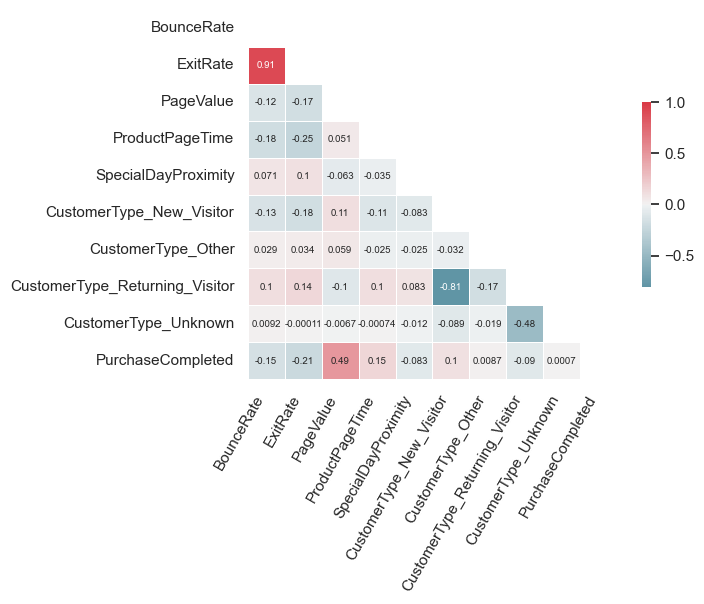
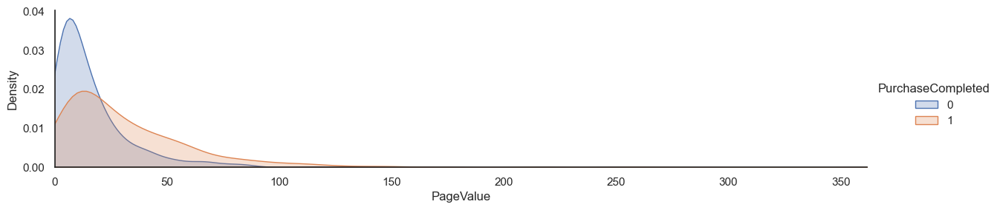
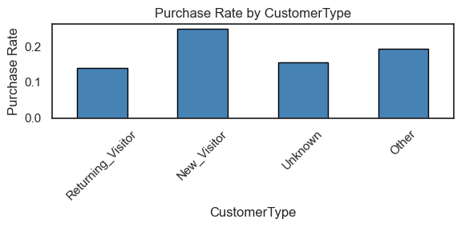

# E-Commerce Purchase Prediction — End-to-End ML Pipeline

A configurable ML pipeline that ingests, cleans, and models e-commerce purchase intent — built with modular, production-oriented code structure.

## Folder Structure

```
ecommerce-purchase-prediction/
├── data/
│   └── online_shopping.db        # SQLite database
├── src/
│   ├── __init__.py
│   ├── config.py                 # All tunable parameters and hyperparameter grids
│   ├── data_loader.py            # Data ingestion from SQLite
│   ├── preprocessing.py          # Data cleaning, feature engineering, train/test split
│   ├── model.py                  # Model definitions, pipeline construction, tuning, evaluation
│   └── main.py                   # Orchestration script — runs the full pipeline
├── eda.ipynb                     # Exploratory Data Analysis notebook
├── modelling_prototype.ipynb     # Model prototyping and feature importance analysis
├── run.sh                        # Bash entry point
├── requirements.txt              # Python dependencies
├── pyproject.toml                # Project metadata
└── README.md                     # This file
```

## Instructions for Execution

**Run the pipeline:**

```bash
bash run.sh
```

This executes `python -m src.main`, which runs the full pipeline end-to-end.

**Modify parameters:**

All configurable parameters are in `src/config.py`:

| Parameter | Description | Default |
|-----------|-------------|---------|
| `DB_PATH` | Path to SQLite database | `data/online_shopping.db` |
| `TABLE_NAME` | Table to query | `online_shopping` |
| `TEST_SIZE` | Test set proportion | `0.2` |
| `RANDOM_STATE` | Random seed for reproducibility | `1` |
| `CV_FOLDS` | Cross-validation folds | `5` |
| `SCORING` | CV scoring metric | `f1` |
| `SCALE_FEATURES` | Columns to standardize | See config |
| `CATEGORICAL_FEATURES` | Columns to one-hot encode | See config |
| `MODELS` | Model hyperparameter search spaces | See config |

To add or remove a model, edit the `MODELS` dictionary. Each entry specifies:
- `search`: `"grid"` or `"random"`
- `n_iter`: Number of iterations (for random search)
- `params`: Hyperparameter grid (keys prefixed with `model__` for the pipeline)

## Pipeline Flow

```
┌──────────────────┐
│  1. Data Load    │  load_data() — SQLite → DataFrame (12,330 rows)
└────────┬─────────┘
         ▼
┌──────────────────┐
│  2. Cleaning     │  clean_data() — fix typos, negatives, drop nulls/duplicates
└────────┬─────────┘
         ▼
┌──────────────────┐
│  3. Feature Eng  │  feature_engineer() — log transforms, binary indicator
└────────┬─────────┘
         ▼
┌──────────────────┐
│  4. Prepare Data │  prepare_data() — one-hot encode categoricals, train/test split
└────────┬─────────┘
         ▼
┌──────────────────┐
│  5. For each     │  For each model in config:
│     model:       │    a. Build sklearn Pipeline (StandardScaler + model)
│                  │    b. Hyperparameter tuning via GridSearchCV / RandomizedSearchCV
│                  │    c. Evaluate best estimator on held-out test set
└────────┬─────────┘
         ▼
┌──────────────────┐
│  6. Compare      │  Print comparison table sorted by F1, identify best model
└──────────────────┘
```

**Step details:**

1. **Data ingestion** — `data_loader.py` reads the SQLite database into a pandas DataFrame.
2. **Cleaning** — `preprocessing.clean_data()` fixes data quality issues identified during EDA (see section e).
3. **Feature engineering** — `preprocessing.feature_engineer()` creates log-transformed features and a binary indicator for PageValue.
4. **Encoding and splitting** — `preprocessing.prepare_data()` converts categorical columns to one-hot encoded features, separates features/target, and performs stratified train/test split.
5. **Model training** — `model.py` constructs a sklearn `Pipeline` with a `ColumnTransformer` (StandardScaler on numeric features, passthrough for the rest) and the model. Hyperparameters are tuned using cross-validated search.
6. **Evaluation** — `model.evaluate_model()` computes metrics on the test set and prints classification report and confusion matrix.

## Key EDA Findings

The dataset contains 12,330 online shopping sessions with 8 features and a binary target (`PurchaseCompleted`). Key findings from EDA:

**Class imbalance:** ~15.5% positive class (purchase completed) — informs the use of `class_weight='balanced'` and F1 as the primary metric.

**Data quality issues identified and addressed:**

| Issue | Detail | Resolution |
|-------|--------|------------|
| Missing values | 616 nulls (~5%) across multiple columns | Dropped rows (MCAR validated; dropna outperformed imputation — LR F1: 0.679 vs 0.655) |
| Typo in CustomerType | `"returning_Visitor"` alongside `"Returning_Visitor"` | Standardized to `"Returning_Visitor"` |
| Invalid CustomerType | Empty strings, `"nan"`, `"None"` | Mapped to `"Unknown"` |
| Negative values | GeographicRegion, BounceRate, ProductPageTime had negatives | Taken absolute values (magnitude is valid, sign is erroneous) |
| Duplicates | Duplicate rows present | Dropped |

**Key visualizations from EDA:**



BounceRate and ExitRate are highly correlated (0.91). PageValue shows the strongest correlation with PurchaseCompleted (0.49).



Filtering out the zero-dominated spike (78% of values) reveals both classes have similar right-skewed distributions, but PurchaseCompleted=1 has a flatter, wider spread. This motivates the binary `has_page_value` feature — the zero vs non-zero split drives most of PageValue's predictive signal.



New visitors convert at ~25% vs returning visitors at ~14%, despite returning visitors dominating the dataset. This informs the personalization recommendation in the actionable insights.

**Feature engineering choices driven by EDA:**

- **`PageValue_log`** and **`ProductPageTime_log`**: Both features are heavily right-skewed. Log transformation (log1p) reduces skew and improves model performance.
- **`has_page_value`**: Binary indicator for whether PageValue > 0. PageValue is zero for ~72% of sessions; this feature captures the strong signal that any non-zero PageValue is associated with higher purchase probability.

**Assumptions:**

- **Negative values are sign errors, not separate categories.** GeographicRegion, BounceRate, and ProductPageTime had small numbers of negative entries. The magnitudes are plausible (e.g., bounce rates of 0.1–0.2, page times of 22–52s, region codes 1–9), so we assume only the sign was corrupted during data collection or ETL. The alternative — treating negatives as missing and imputing to 0 — would discard real information.
- **Missing values are MCAR (Missing Completely At Random).** Null entries (~5% of rows) showed no strong pattern across features, supporting the assumption that missingness is random. This justified using `dropna` over imputation, which also outperformed imputation empirically (LR F1: 0.679 vs 0.655 with median imputation).
- **Invalid CustomerType entries represent missing data.** Empty strings, `"nan"`, and `"None"` were consolidated into `"Unknown"` rather than dropped, since the absence of customer type information may itself be predictive.
- **Log transforms are appropriate for right-skewed features.** PageValue and ProductPageTime are heavily right-skewed with long tails. `log1p` reduces skew and compresses the range, which benefits linear models (LR) and can improve split quality for tree-based models.
- **TrafficSource and GeographicRegion are categorical despite being numeric.** These are coded identifiers (1–20 and 1–9 respectively), not continuous measurements. Treating them as numeric would imply an ordinal relationship (e.g., region 9 > region 1) that has no semantic basis.

## Feature Processing

| Feature | Type | Processing |
|---------|------|------------|
| `CustomerType` | Categorical | Fix typo, map invalid to "Unknown", one-hot encode |
| `SpecialDayProximity` | Numeric | Passthrough (no issues found) |
| `ExitRate` | Numeric | Standard scaling |
| `PageValue` | Numeric | Standard scaling |
| `TrafficSource` | Categorical (numeric codes) | Convert to string, one-hot encode |
| `GeographicRegion` | Categorical (numeric codes) | Take abs of negatives, convert to string, one-hot encode |
| `BounceRate` | Numeric | Take abs of negatives, standard scaling |
| `ProductPageTime` | Numeric | Take abs of negatives, standard scaling |
| `has_page_value` | Engineered (binary) | Created from PageValue > 0 |
| `PageValue_log` | Engineered (numeric) | log1p(PageValue), standard scaling |
| `ProductPageTime_log` | Engineered (numeric) | log1p(ProductPageTime), standard scaling |

## Model Choices

Three models were selected to represent fundamentally different learning strategies:

| Model | Strategy | Rationale |
|-------|----------|-----------|
| **Logistic Regression** | Linear, regularized (ElasticNet) | Interpretable baseline. ElasticNet penalty with tunable L1 ratio provides built-in feature selection. Fast to train, sets a performance floor. |
| **LightGBM** | Gradient boosting (sequential ensemble) | Sequentially corrects errors from previous trees. Typically achieves the best predictive performance on tabular data. Handles feature interactions natively. |
| **Random Forest** | Bagging (parallel ensemble) | Aggregates many independent decision trees via bagging. Robust to overfitting, handles non-linear relationships. Provides a contrast to the boosting approach of LightGBM. |

This selection covers **linear vs. bagging vs. boosting** — three distinct paradigms — allowing meaningful comparison. All models are configured with `class_weight='balanced'` to handle the ~16.2% minority class (after cleaning).

### Hyperparameter Tuning

| Model | Search Strategy | Reason | Key Hyperparameters |
|-------|----------------|--------|---------------------|
| **Logistic Regression** | Grid search | Small search space (30 combinations) — exhaustive search is feasible | `C` (regularization strength), `l1_ratio` (L1 vs L2 mix — 0 = pure L2/Ridge, 1 = pure L1/Lasso), `solver` (saga, supports ElasticNet) |
| **LightGBM** | Randomized search (50 iter) | Large search space (~thousands of combinations) — grid search is impractical | `n_estimators` (number of boosting rounds), `learning_rate` (step size), `max_depth`/`num_leaves` (tree complexity), `subsample`/`colsample_bytree` (regularization via subsampling) |
| **Random Forest** | Randomized search (50 iter) | Same rationale as LightGBM — large combinatorial space | `n_estimators` (number of trees), `max_depth` (tree depth), `min_samples_split`/`min_samples_leaf` (regularization), `max_features` (feature subsampling per split) |

All tuning uses **5-fold stratified cross-validation** with **F1 as the scoring metric**. Stratified folds preserve the class distribution (~16.2% positive) in each fold, ensuring the CV score reflects real-world performance on imbalanced data. The best hyperparameter combination from CV is then evaluated on the held-out test set.

## Evaluation

**Primary metric: F1 score** — chosen because:
- The dataset is class-imbalanced (~16.2% positive after cleaning). Accuracy is misleading here (a naive classifier predicting all negatives achieves ~83.8% accuracy).
- F1 balances precision and recall, which is appropriate for purchase prediction: we want to correctly identify buyers (recall) without flooding non-buyers with promotions (precision).

**Additional metrics reported:**

| Metric | Purpose |
|--------|---------|
| **Accuracy** | Overall correctness (included for completeness) |
| **Precision** | Of predicted purchases, how many actually purchased |
| **Recall** | Of actual purchases, how many were correctly identified |
| **AUC-ROC** | Discriminative ability across all thresholds — useful for comparing models independently of a specific decision threshold |
| **Best CV F1** | Cross-validated F1 on training set — indicates generalization and whether the model is overfitting |

The pipeline prints a comparison table sorted by F1, along with per-model classification reports and confusion matrices.

**Results (sorted by F1):**

| Model | Accuracy | Precision | Recall | F1 | AUC-ROC | CV F1 |
|-------|----------|-----------|--------|-----|---------|-------|
| **Random Forest** | 0.8818 | 0.6092 | 0.7584 | **0.6756** | 0.9048 | 0.6740 |
| LightGBM | 0.8687 | 0.5652 | 0.8289 | 0.6721 | **0.9130** | 0.6677 |
| Logistic Regression | 0.8742 | 0.5857 | 0.7685 | 0.6647 | 0.8706 | 0.6714 |

Random Forest achieves the highest F1 (0.6756) with the best precision-recall balance. LightGBM has the highest AUC-ROC (0.9130), indicating strong discriminative ability across all thresholds. All three models show minimal CV-to-test gap, suggesting no overfitting.

*Note: Results may vary slightly across runs due to non-deterministic parallel execution (`n_jobs=-1`). The values above are representative of typical pipeline output.*

### Key Factors Influencing Purchase Decisions

Feature importance was extracted from the best-performing models to identify the key drivers of purchase completion. The top factors are consistent across LightGBM (split-based importance) and Random Forest (Gini importance):

| Rank | Feature | LightGBM Importance | RF Importance | Interpretation |
|------|---------|---------------------|---------------|----------------|
| 1 | **PageValue / has_page_value** | 104 (PageValue) | 0.23 (PageValue_log), 0.15 (has_page_value) | Strongest predictor. Sessions where users interact with product pricing or add items to cart are far more likely to convert. |
| 2 | **ExitRate** | 112 | 0.088 | High exit rates indicate users leaving the site — a strong negative signal for conversion. |
| 3 | **ProductPageTime** | 78 (log: 72) | 0.091 (log: 0.085) | Longer engagement with product pages correlates with purchase intent. |
| 4 | **BounceRate** | 75 | 0.057 | Single-page sessions without interaction rarely lead to purchases. |
| 5 | **SpecialDayProximity** | 53 | 0.011 | Proximity to special days (e.g., holidays) influences purchasing behavior. |
| 6 | **CustomerType** | 25 (Returning) | 0.010 (Returning) | Returning visitors have different conversion patterns than new visitors. |
| 7 | **TrafficSource** | 33 (Source 2) | 0.014 (Source 2) | Certain traffic channels drive higher-intent visitors. |

*Note: Logistic Regression's optimal regularization (C=0.001, pure L1/Lasso) selected only PageValue_log as a non-zero coefficient, confirming PageValue's dominance but providing limited feature-level granularity.*

### Actionable Insights to Improve Conversion Rates

1. **Optimize the path to product value** — PageValue is the dominant predictor across all models. Streamline the journey from landing page to product pages and simplify the add-to-cart experience. Users who engage with pricing are strongly likely to purchase.

2. **Reduce exit and bounce rates** — ExitRate and BounceRate are the top features in LightGBM. Audit pages with the highest exit rates (likely checkout flow or poorly designed product pages) and address friction points such as slow load times, confusing navigation, or unexpected costs at checkout. Sessions with PageValue=0 and high BounceRate convert at under 1% — this "low intent" segment is a clear candidate for landing page improvements or paid traffic exclusion.

3. **Increase product page engagement** — ProductPageTime is a strong positive signal. Enrich product pages with detailed descriptions, customer reviews, comparison tools, and high-quality images to increase dwell time and purchase confidence.

4. **Investigate special day proximity** — Counterintuitively, sessions closer to special days show *lower* conversion (~6%) compared to non-special-day sessions (~17%). This may reflect browsing/research behavior near holidays rather than purchasing. Promotions should account for this pattern — consider targeting special-day visitors with retargeting campaigns rather than expecting immediate conversion.

5. **Personalize by customer type** — New visitors convert at ~25% vs returning visitors at ~14%, despite returning visitors spending more time on product pages. This suggests returning visitors may face friction (price comparison, checkout UX, trust). Offer loyalty incentives, saved carts, and price-drop notifications for returning visitors, and maintain the strong first-visit experience for new visitors.

6. **Invest in high-converting traffic channels** — Certain TrafficSource values (e.g., sources 2, 8) are associated with higher conversion. Allocate marketing budget toward these channels and investigate what makes them effective.

## Deployment Considerations

This pipeline covers the **Experimentation** phase of an end-to-end MLOps architecture: data extraction, data preparation, model training, and model evaluation. Moving to production would involve the additional stages outlined below.

**Data Validation** — Before training, validate incoming data against expected schema, null rates, and value ranges (e.g., using Great Expectations). This catches upstream data issues early — for example, detecting if `TrafficSource` suddenly has new category codes or if null rates spike beyond the ~5% baseline observed during EDA.

**Model Validation** — After evaluation, verify that the best model meets minimum performance thresholds (e.g., F1 > 0.60) before promoting it. This acts as a gate to prevent deploying a degraded model if, for instance, the training data was corrupted or a feature pipeline broke.

**Model Registry** — Serialize the best pipeline (`joblib.dump`) and version it in a model registry (e.g., MLflow). The sklearn Pipeline bundles preprocessing with the model, preventing train-serve skew. Versioning enables rollback if a new model underperforms in production.

**CI/CD and Pipeline Deployment** — Automate testing, packaging, and pipeline deployment via CI/CD (e.g., GitHub Actions). The pipeline should be runnable end-to-end in a reproducible environment, triggered by schedule or data refresh events.

**Model Serving** — Wrap the serialized pipeline in an inference server (e.g., FastAPI) for real-time predictions. For batch use cases, the pipeline can run as a scheduled job. The prediction threshold (default 0.5) should be tuned based on business costs — false positives (unnecessary promotions to non-buyers) vs. false negatives (missed conversions).

**Monitoring and Retraining** — Track input feature distributions and prediction outcomes in production (e.g., whylogs) to detect data drift (e.g., new traffic sources, seasonal shifts) or concept drift (e.g., changing purchase behavior). Trigger retraining when drift is detected or on a periodic schedule, feeding updated data through the same pipeline.
